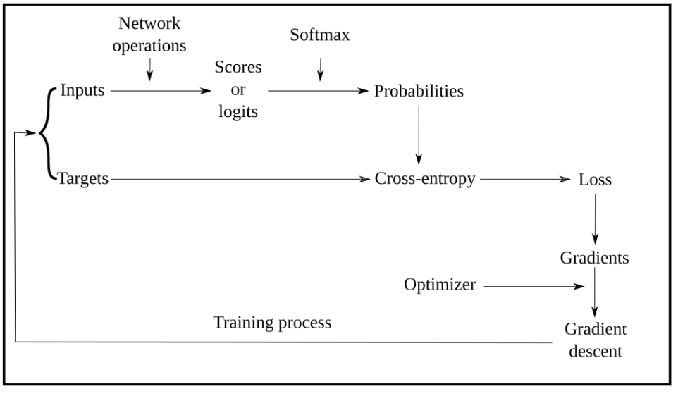
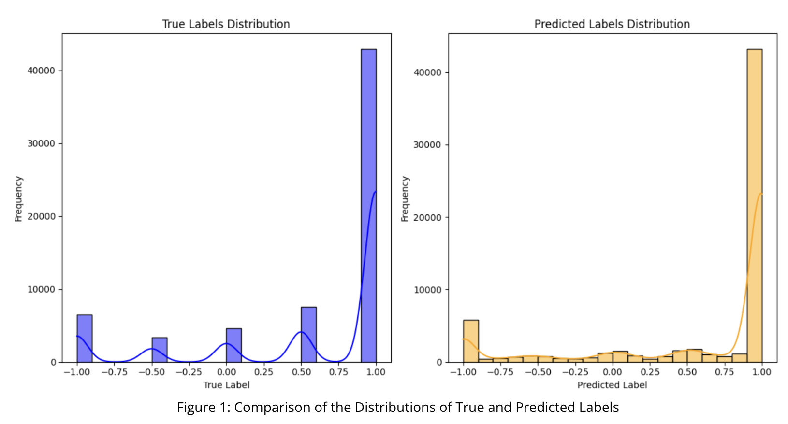
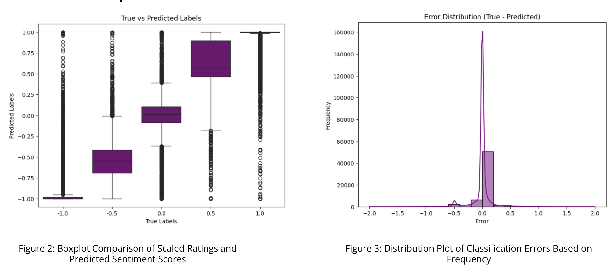
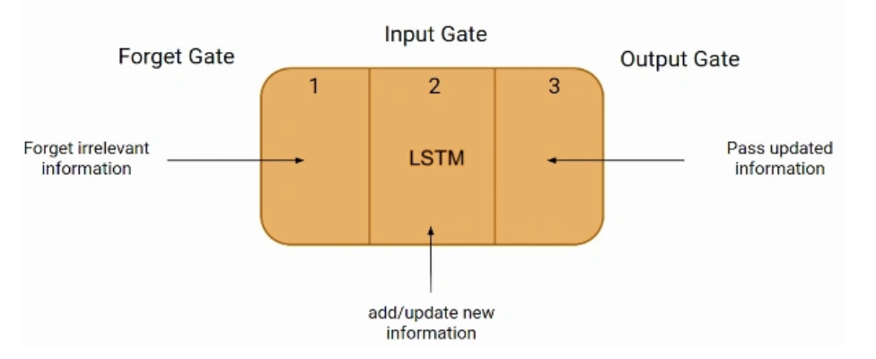
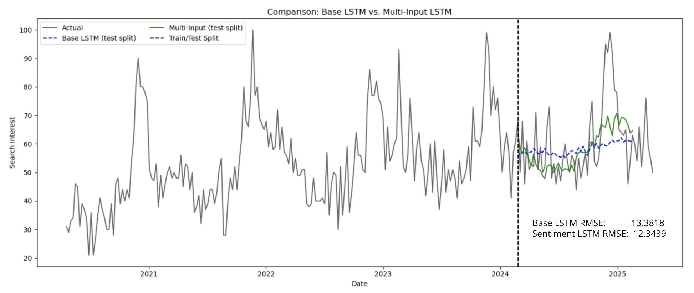

# Sentiment-Augmented-Trend-Forecasting
This project explores how consumer sentiment can be integrated into predictive models for Levi’s sales and product demand trends. By combining e-commerce reviews and Google Trends, this aims to forecast sales fluctuations and promotions more accurately.

This approach demonstrates that incorporating sentiment analysis consistently improves forecasting performance across time series modeling techniques, in this case augmenting an LSTM regression model with sentiment scores from BERT.

## Data Sources
E-commerce websites website – product specifications, verified consumer reviews (Levi's, Macy's, etc)
Google Trends – search interest for Levi’s product keywords

## Data Collection & Processing
Scraping Tools: BeautifulSoup, Selenium, Firefox WebDriver
Volume: ~60,000 reviews collected in ~13 hours
Cross-platform matching: Splink fuzzy matching (Levenshtein + Jaro-Winkler)

Text Processing:
- Google Translate API for non-English reviews
- Emoji-to-sentiment normalization
- Sentiment scoring via BERT fine-tuning

Feature Engineering:
- Sentiment metrics (rolling averages & volatility)
- Product attributes (fit, style, material, etc.)
- Review-based statistics (ratings, counts, engagement)
- External signals (Google Trends, climate data, holidays, promotions)

## Sentiment Analysis
Model: BERT (fine-tuned on Levi’s reviews)
- Transformer-based model (attention mechanism)
- Bidirectional encoder/decoder setup allows for nuanced natural language processing while being pretrained on a massive collection of text
  
Review Preprocessing:
- Translate non-english reviews, normalize emojis and symbols (e.g. heart = good, thumb down = bad)
- Tokenize data to feed into BERT
  
Training Methods:
- Compute loss with MSELoss to see how model is doing vs labeled dataset
- Adjust neural layer node weights with AdamW optimizer (stochastic gradient descent where weight decay is decoupled from gradient update)
- Decay learning rate for fine tuning with LinearLR
- Training: 41548, Validation: 10387, Test: 12984

Performance: MAE = 0.1328, MSE: 0.0787, RMSE = 0.2805, R² = 0.8286

## Time-Series Predictive Model
Model: LSTM (Long-Short Term Memory)
- Recurrent neural network structure with architecture that allows for long term and non-linear dependencies
- Naturally sequential and efficient, making it great for iterative tasks like modeling with time-series data

Trend Data:
- Train LSTM on 5 year Google Trends data
- Augment deep learning training with sentiment data and observe difference
  
Training Methods:
- Aggregated sentiment scores and merged with search trend data
- Use lookback data as input to predict future
- MSELoss (cost function), Adam (stochastic gradient-based optimization), layer dropout (to deal with overfitting)
  

## Key Results
Sentiment consistently improved prediction accuracy across models. Sentiment signals could act as a substitute for missing seasonality/memory in deep learning time-series models while preserving the foresight and stability of the original models.

